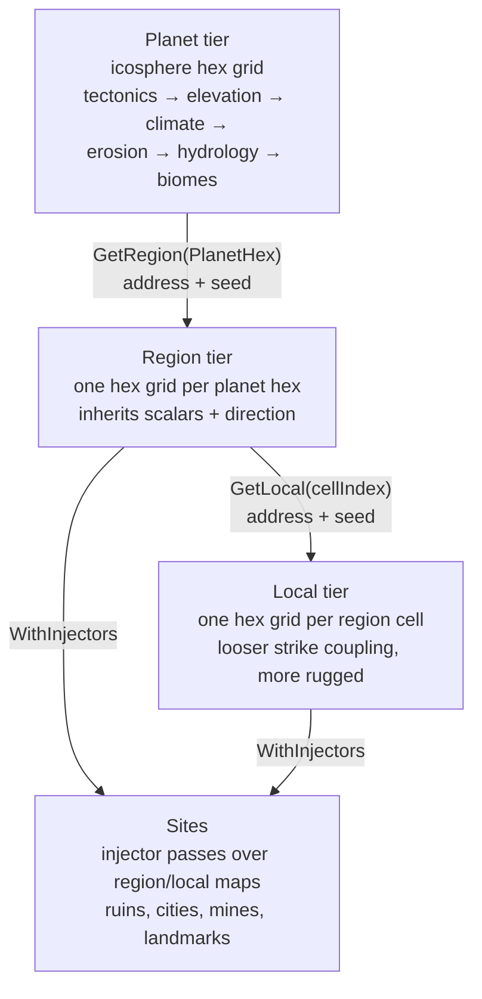
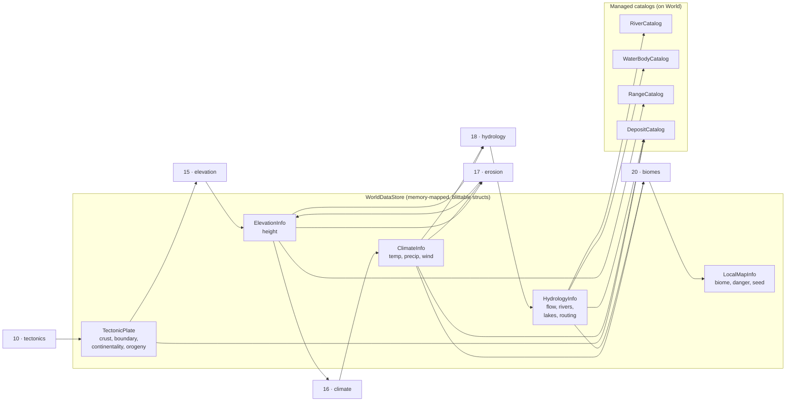
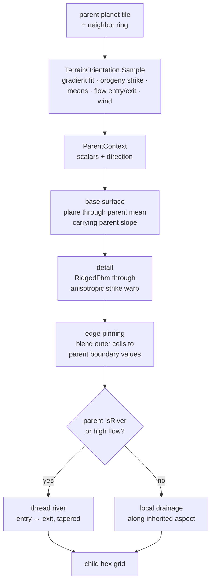
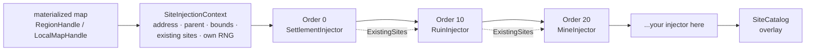
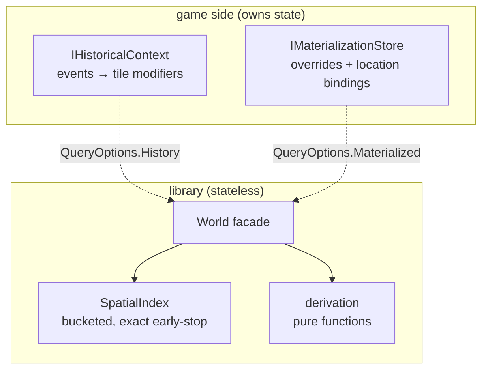

# Architecture — how the pieces fit together

This doc is for contributors and the curious: the big picture, the data flow, and why things are shaped the way they are. For "how do I use it", see [API.md](API.md). Diagrams are Mermaid — GitHub renders them inline.

## The one-paragraph version

The planet is generated once (tectonics through biomes) into dense per-tile field layers plus sparse feature catalogs. Everything below the planet — region grids, local grids, placed sites — is derived on demand as a pure function of (world seed, address), inheriting the parent's scalars *and* direction so zoomed maps look like magnifications, not fresh rolls. Games persist things (overrides, location bindings, history) on their side; the library consumes them at query time and stores nothing itself.

## Tier hierarchy

Three things to notice:

- Arrows point one way. Children know their parent (every handle carries `Parent` and `Address`); parents know nothing about children. That's what keeps derivation storageless.
- Region and local maps are the same `IHexMap<TTile>` shape — flat-top hex grids with axial/cube addressing — so adjacency, ranges, and movement code is written once.
- Sites are an overlay, not a layer. They live in a managed `SiteCatalog`, never in the memory-mapped field store.

## Planet generation pipeline

Notes:

- Stages are `IWorldGeneratorStage` with `[WorldGeneratorStage(Order)]` and `Reads`/`Writes` contracts — a blind second writer of a layer throws instead of silently winning. Erosion is the model citizen: it reads elevation and refines it.
- Field layers (dense, every tile) live in the store. Features (sparse, some tiles) live in catalogs. That split is load-bearing: it keeps the hot store cache-friendly and blittable while features stay flexible managed objects with tile-id lists and WKT export.
- Deposits seed *after* the build from finished tectonics + climate + hydrology — prospecting reads the finished world, it doesn't participate in shaping it.

## Zoom derivation: keeping the ridge in the north-west

Why this shape:

- **Scalars alone lose direction.** Mean elevation + biome + moisture tells the child *what* the parent is, not *which way it tilts*. The gradient/strike/flow fields are what make a zoomed map read as "the same place, closer".
- **Strike comes from the orogeny field, not elevation.** Orogeny is smoother and is the actual belt signal; elevation already has hills and noise mixed in. When tectonics are present the strike also aligns with the drift-perpendicular, so ranges run along boundaries the way they do on Earth.
- **Edge pinning is what makes sibling maps stitch.** Without it, two adjacent child maps each roll their own boundary and you get cliffs along invisible seams. Pinning blends outer cells to parent-interpolated values over a configurable band (`EdgePinCells`).
- **Region follows tightly, local loosely.** `RegionDefault` uses strong across/along-strike warp (3.0 / 0.2); `LocalDefault` relaxes it (1.8 / 0.5) with a bit more amplitude — structure at region scale, ruggedness at local scale.

## Injector pipeline

- Ordered passes, duplicate `Order` throws. Boring and predictable on purpose.
- Each injector's RNG is derived from (injector id, address) — adding a new injector never reshuffles earlier placements. Removing one doesn't either.
- Injectors see the map *with its boundaries* (`Bounds`: center, radius, edge-ring cells) plus the parent context, so placement can reason about "near the map edge" or "on the wet side".
- `NameSeed` is deliberately opaque: the library doesn't do fantasy names. It gives you a stable random draw; your name generator does the rest.

## Queries and persistence

The dotted lines are the whole philosophy: the library never stores game state and never simulates history. Both cross the boundary per-query through `QueryOptions`, and null means pure geography. Concretely:

- `IHistoricalContext` (Caves-of-Qud-style: your events projected onto tiles/sites) shifts danger/habitability.
- `IMaterializationStore` applies `TileOverride`s (replacement, not additive) and maps `MapAddress` ↔ your location ids. `MaterializationStore` is the in-memory implementation for tests and small games; a campaign manager implements the interface over its own DB.
- `SpatialIndex` answers nearest-feature queries without scanning the map. It's planet-tier; lower-tier addresses resolve to their parent planet tile.

## Determinism contract

Worth stating plainly since everything depends on it:

1. Same `(worldSeed, size, stage set)` → same planet. (`Rng` sub-streams keyed by seed + salt, never by iteration order.)
2. Same `(worldSeed, address)` → same child map, on any machine, in any derivation order. Parent fields are deterministic, and everything downstream is a pure function of them.
3. Same `(injector id, address, map)` → same sites. Injectors share no RNG state.
4. Overrides and history are the *only* non-deterministic inputs, and they arrive per-query from the game side.

If you ever find two runs disagreeing, it's a bug — the test suite has determinism tests at every tier, and they'd like to hear about it.

## File map

| Area | Files |
|---|---|
| Facade + builder | `World.cs` |
| Planet store + topology | `WorldDataStore.cs`, `WorldMap.cs`, `IcosphereGenerator.cs` |
| Generation stages | `TectonicPlateGenerationStage.cs`, `ElevationGenerationStage.cs`, `ClimateStage.cs`, `ErosionGenerationStage.cs`, `HydrologyStage.cs`, `LocalMapGenerationStage.cs` |
| Pipeline + contracts | `WorldGenerationPipeline.cs`, `IWorldGeneratorStage.cs`, `WorldGeneratorStageAttribute.cs`, `StageContractValidator.cs`, `ISeededStage.cs` |
| Field layers | `TectonicPlateLayer.cs`, `ElevationLayer.cs`, `ClimateInfo.cs`, `HydrologyInfo.cs`, `LocalMapInfo.cs`, `ElevationInfo.cs`, `IMapOverlay.cs`, `IMapLayer` bits |
| Hierarchy + derivation | `MapAddresses.cs`, `MapBounds.cs`, `ParentContext.cs`, `TerrainOrientation.cs`, `RegionMaps.cs`, `IHexMap.cs` |
| Sites | `SiteInjectors.cs` |
| Queries | `SpatialIndex.cs`, `TileFeatures.cs`, `CitySites.cs`, `Deposits.cs`, `FeatureCatalog.cs`, `Hydrography.cs`, `CanyonAnalysis.cs` |
| Game-owned state | `HistoryHooks.cs`, `Materialization.cs` |
| Randomness + noise | `Rng.cs`, `SphereNoise.cs`, `Glaciology.cs`, `PlatePartitioning.cs`, `ArenaDefaults.cs` |

## Performance notes (no benchmarks were harmed)

- Generation is the expensive part and happens once per world; it leans on contiguous spans, cached tile vectors, and a cached pipeline order so repeated runs stay allocation-light.
- Derivation is per-map and lazy — you pay for the hexes you zoom into, not the planet.
- Queries hit the spatial index, not full scans. The index build itself is O(tiles) once.
- The one thing to watch: `TileFeatures.Query` copies the elevation span for upstream/downstream tracing (single-tile inspector path, not a hot loop). If it ever shows up in a profile, that's the first place to look.
